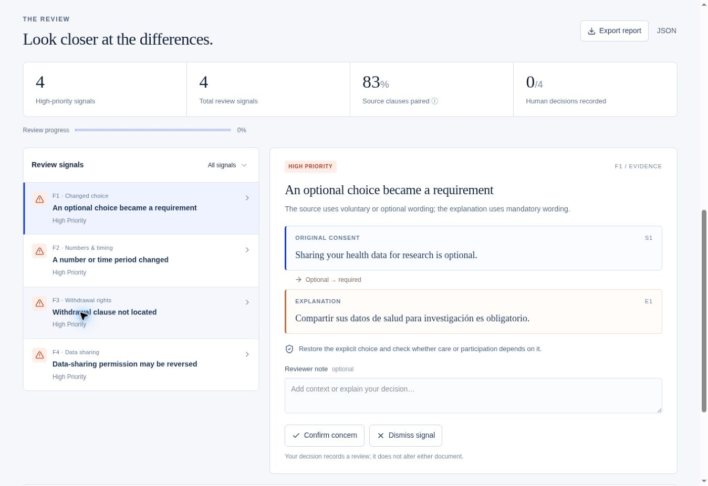

# ConsentLens

**Keep meaning in consent.** Compare an English or Spanish consent document with its translation or plain-language explanation, inspect exact evidence, and record a human review.

Built for LexHack 2026. A research prototype; it does not establish legal validity, clinical safety, or translation equivalence.

## Try it in two minutes

1. Open [ConsentLens](https://consentlens.sammccray03.chatgpt.site). No sign-in or API key is needed.
2. Leave **Research consent · EN → ES** selected and choose **Compare documents**.
3. Inspect four signals: optional becomes mandatory, 30 days becomes 90, a withdrawal clause is not located, and a sharing prohibition loses its negation.
4. Read both passages, add a note, and confirm or dismiss a signal. These actions record a review; they do not rewrite the document.
5. Export HTML or JSON. Each includes both complete texts, exact evidence spans, reviewer decisions, engine version, and SHA-256 text hashes.
6. Open **Evaluation → Run evaluation** to run 16 synthetic regression cases. This is not an independent accuracy benchmark.



## What works

- English → Spanish, Spanish → English, and same-language comparisons using a bounded vocabulary.
- Six categories: missing information, changed negation, changed choice, numbers/timing, data sharing, and withdrawal rights.
- Clause pairing with explicit uncertain/unmatched passages and original character offsets.
- Local TXT, Markdown, and text-based PDF input. PDFs: 5 MB, 30 pages. Documents: 40,000 characters and 300 clauses each.
- Human decisions and notes, with stale-result protection when either input changes.
- Standalone HTML and structured JSON reports. Use browser Print → Save as PDF for a PDF report.
- Four fictional examples, transparent limitations, and runnable evaluation inside the app.
- No application account, document database, paid model, external translation API, or document telemetry.

## How it works

The TypeScript engine in [`lib/audit.ts`](lib/audit.ts) splits review units while preserving original offsets. A small bilingual concept/word vocabulary and normalized token overlap suggest pairings. Explicit rules compare modality, negation, quantities, recipients, and missing clauses. Every finding points to original text or clearly says a match was not located.

This is a **deterministic screening aid**, not an LLM judge. It can inspect an AI-generated explanation, but makes no runtime model requests and does not invent replacement legal or medical language. A reviewer makes the final decision.

The interface uses React, TypeScript, shadcn/base UI components, Lucide icons, and PDF.js, and @noble/hashes. Vinext/Vite builds a Cloudflare Workers-compatible application for Sites hosting. PDF.js is loaded only for PDF uploads; its worker is served from the same origin and is copied from the locked PDF.js package during installation. Optional WebMCP registration uses the same comparison action and feature-detects browser support.

## Run locally

Requirements: Node.js **22.13 or newer**, pnpm **11.25.0**. Report hashing uses the local @noble/hashes implementation. No environment secrets are needed.

```sh
git clone https://github.com/samdev-03/consentlens.git
cd consentlens
corepack enable
corepack prepare pnpm@11.25.0 --activate
pnpm install --frozen-lockfile
pnpm dev
```

Open `http://localhost:5173`. On Windows, use PowerShell or a JetBrains terminal. If Node does not include Corepack, install pnpm using its official instructions. Clean clones use the portable framework profile; managed deployment settings are local tooling and are not committed.

```sh
pnpm test
pnpm typecheck
pnpm build
pnpm start
```

Production output targets Cloudflare Workers. `pnpm start` serves the built output locally with Wrangler; use the URL it prints.

## Project map

| File | Purpose |
| --- | --- |
| `components/consent-workspace.tsx` | Comparison, review, exports, evaluation UI |
| `lib/audit.ts` | Pure alignment and signal engine |
| `lib/examples.ts` | Four fictional document pairs |
| `lib/fixtures.ts` | Sixteen author-defined regression cases |
| `lib/read-file.ts` | Local file/PDF text extraction |
| `lib/report.ts` | HTML/JSON reports, escaping, text hashes |
| `tests/audit.test.mjs` | Signal, offset, boundary, determinism checks |
| `docs/DEMO_SCRIPT.md` | Human narration and click sequence |
| `docs/DEVPOST_STORY.md` | Submission narrative and AI disclosure |
| `docs/LIMITATIONS.md` | Scope, privacy, interpretation limits |

## Validation

The automated suite passes **24/24 checks**, including 21 engine checks: 16 fixture category sets plus exact Unicode offsets, input bounds, deterministic output, and instruction-like text treated as data. In-browser evaluation returns **16/16 expected category sets**. These are authored regression checks, not measured precision, recall, or clinical effectiveness. See [`docs/VERIFICATION.md`](docs/VERIFICATION.md).

## Privacy and limitations

Parsing, screening, review state, and exports run in the browser. This app does not transmit document text to a server or save it to local storage. Refreshing or closing clears the workspace. Hosting receives ordinary page and asset requests. Downloaded reports contain your texts and notes.

Signals can be false positives; no signals can be false negatives. Pairing coverage is **not accuracy**. Negation scope, exceptions, paraphrases, splitting, unit conversions, and PDF reading order can defeat the rules. Scanned PDFs are unsupported. Review complete documents with qualified bilingual/legal/clinical reviewers as appropriate. Hashes identify text; they do not prove authorship, reviewer identity, or report integrity.

## Original work and AI assistance

ConsentLens-specific UI, rules, examples, tests, exports, and submission material were created for this hackathon. ChatGPT/Codex substantially assisted implementation, design, tests, documentation, and deployment. The application uses an existing Sites/Vinext starter and third-party packages; those are not claimed as original work. No runtime LLM is used. All samples are fictional and contain no patient records.

PDF.js retains its Apache-2.0 license in `public/PDFJS-LICENSE`; the Sites build plugin retains its bundled license. Other packages retain their upstream licenses.
